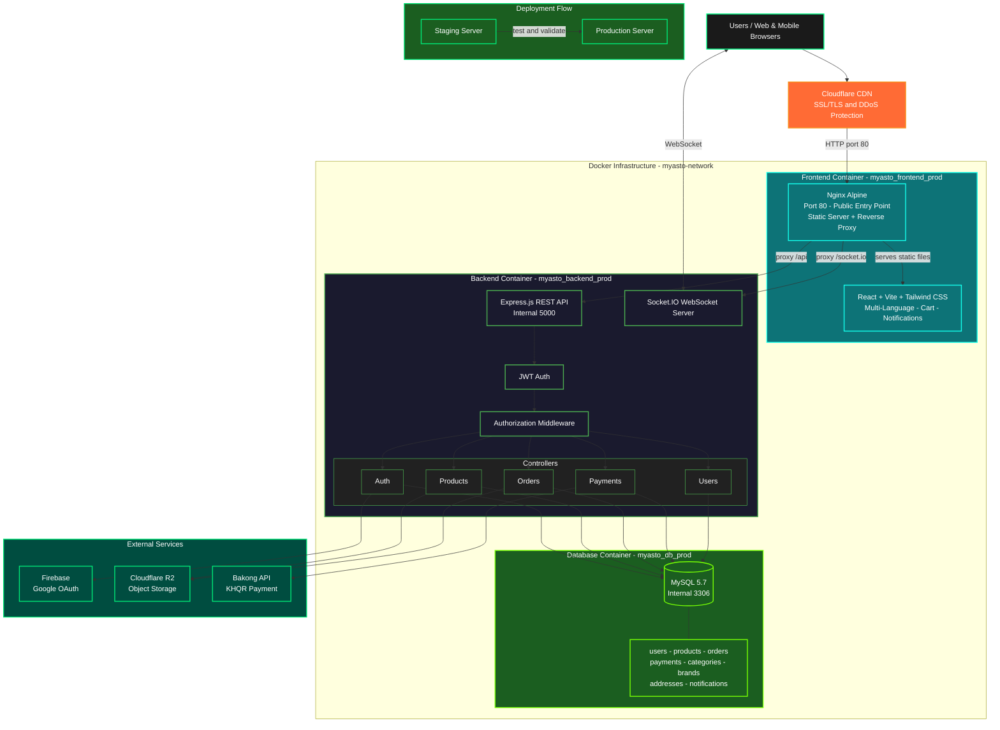

# Asto Gear - Computer Accessories E-commerce Platform

🌐 **Live Demo:** [astogear.com](https://astogear.com)

---

## Full Demo Video

[Watch the complete walkthrough on YouTube](https://www.youtube.com/watch?v=LKBMF5jg0k8)

---

## 📺 Demo

### Authentication


### Homepage & Product Browsing


### Product Details


### Shopping Cart & Checkout


### Payment Integration


### Real-time Notifications


### Seller Dashboard


---

## System Architecture


The diagram above illustrates the complete system architecture of Asto Gear, showing the flow from users through CDN and reverse proxy layers, to the containerized application services, database, and external API integrations.
---

## Table of Contents

- [Overview](#overview)
- [Features](#features)
- [Tech Stack](#tech-stack)
- [Project Structure](#project-structure)
- [Getting Started](#getting-started)
- [Environment Variables](#environment-variables)
- [Available Scripts](#available-scripts)
- [API Endpoints](#api-endpoints)
- [Security](#security)
- [Contact](#contact)

---

## Overview

Asto Gear lets users browse, configure, and purchase computer accessories online. The platform supports three roles — **Customer**, **Seller**, and **Admin** — each with tailored functionality. All orders include free delivery.

---

## Features

**Customers**

- Register / login via email or Google OAuth
- Browse, search, and filter products by brand or category
- Add to cart and checkout
- Pay via Bakong KHQR
- Real-time order status updates via WebSocket
- Choose delivery provider: JNT Express, Vireak Buntham, or Grab
- Switch UI language: Khmer, Chinese, English

**Sellers & Admins**

- Full CRUD for products, brands, and categories
- Monitor user login/signup activity
- Track and manage all orders

---

## Tech Stack

| Layer    | Technology                                          |
| -------- | --------------------------------------------------- |
| Frontend | React, Vite, Tailwind CSS, Socket.io Client         |
| Backend  | Node.js, Express.js, Socket.IO                      |
| Database | MySQL 5.7, Sequelize ORM                            |
| Auth     | JWT, Firebase (Google OAuth)                        |
| Payment  | Bakong KHQR API                                     |
| Storage  | Cloudflare R2                                       |
| Email    | Nodemailer                                          |
| DevOps   | Docker, Docker Compose, Nginx, GitHub Actions CI/CD |

---

## Project Structure

```
myasto/
├── .github/
│   └── workflows/
│       ├── deploy-production.yml
│       ├── deploy-staging.yml
│       └── test.yml
│
├── backend/
│   ├── config/
│   │   ├── cloudinary.js              # Cloudinary config
│   │   ├── r2.js                      # Cloudflare R2 / AWS S3 config
│   │   └── sequelize.js               # Sequelize DB connection
│   ├── controllers/
│   │   ├── auth.controller.js
│   │   ├── brand.controller.js
│   │   ├── category.controller.js
│   │   ├── notificatoin.controller.js
│   │   ├── order.controller.js
│   │   ├── payment.controller.js
│   │   ├── product.controller.js
│   │   ├── productBanner.controller.js
│   │   ├── recipt.controller.js
│   │   └── user.controller.js
│   ├── mail/
│   │   ├── generateCode.js
│   │   ├── mailerConfig.js            # Nodemailer transport config
│   │   └── mailService/
│   │       ├── EmailService.js
│   │       ├── sendPasswordResetEmail.js
│   │       ├── sendResetSuccessEmail.js
│   │       ├── sendVerificationEmail.js
│   │       └── sendWelcomEmail.js
│   ├── middleware/
│   │   ├── autheticate.js             # JWT verification
│   │   ├── authorizeRoles.js          # Role-based authorization
│   │   ├── loadUserdata.js            # Load user from token
│   │   ├── uploadMedia.js             # Multer media upload
│   │   └── validator.js               # Request validation
│   ├── models/
│   │   ├── index.js                   # Model associations
│   │   ├── address.js
│   │   ├── brand.js
│   │   ├── category.js
│   │   ├── notification.js
│   │   ├── order.js
│   │   ├── orderItem.js
│   │   ├── payment.js
│   │   ├── product.js
│   │   ├── productBanner.js
│   │   ├── productFeature.js
│   │   ├── productImage.js
│   │   ├── ProductVideo.js
│   │   ├── review.js
│   │   └── user.js
│   ├── routes/
│   │   ├── auth.routes.js
│   │   ├── brand.routes.js
│   │   ├── category.routes.js
│   │   ├── checkout.routes.js
│   │   ├── notification.routes.js
│   │   ├── order.routes.js
│   │   ├── payment.routes.js
│   │   ├── product.routes.js
│   │   ├── recipt.routes.js
│   │   └── user.routes.js
│   ├── scripts/
│   │   └── migrate_cloudinary_to_r2.js
│   ├── utils/
│   │   ├── generateOrderID.js
│   │   └── generateTokenAndSetCookie.js
│   ├── .env.example
│   ├── Dockerfile
│   ├── server.js                      # Entry point
│   └── wait-for-db.sh                 # DB readiness wait script
│
├── frontend/
│   ├── context/
│   │   ├── UserContext.jsx
│   │   └── notificationContext/
│   │       └── NotificationContext.jsx
│   ├── utils/
│   │   ├── AboutUs.jsx
│   │   ├── Footer.jsx
│   │   ├── ScrollToTheTop.jsx
│   │   ├── analytics.jsx
│   │   └── googleTranslateService.js
│   ├── public/
│   │   ├── favicon.png
│   │   ├── promotionasto.png
│   │   └── vite.svg
│   ├── src/
│   │   ├── api/                       # Axios API call modules
│   │   │   ├── http.js                # Axios instance & base config
│   │   │   ├── Auth.api.js
│   │   │   ├── BrandProduct.api.js
│   │   │   ├── CategoryProduct.api.js
│   │   │   ├── Checkout.api.js
│   │   │   ├── notification.api.js
│   │   │   ├── order.api.js
│   │   │   ├── payment.api.js
│   │   │   ├── Product.api.js
│   │   │   ├── ProductBanner.api.js
│   │   │   ├── Recipt.api.js
│   │   │   └── User.api.js
│   │   ├── assets/
│   │   │   ├── ceo/
│   │   │   ├── flag/
│   │   │   ├── logoes/
│   │   │   └── qrcode/
│   │   ├── auth/                      # Auth pages & components
│   │   │   ├── RootAuthLayout.jsx
│   │   │   ├── components/
│   │   │   │   └── signup/
│   │   │   │       └── GoogleAuth.jsx
│   │   │   ├── firebase/
│   │   │   │   └── config.js
│   │   │   └── pages/
│   │   │       ├── EmailEntry.jsx
│   │   │       ├── ForgotPassword.jsx
│   │   │       ├── Login.jsx
│   │   │       ├── ResetPassword.jsx
│   │   │       ├── Signup.jsx
│   │   │       └── VerifyEmail.jsx
│   │   ├── customer/                  # Customer storefront
│   │   │   ├── RootCustomerLayout.jsx
│   │   │   ├── context/
│   │   │   │   └── CartContext.jsx
│   │   │   ├── components/
│   │   │   │   ├── address/
│   │   │   │   └── recipt/
│   │   │   └── pages/
│   │   │       ├── Homepage.jsx
│   │   │       ├── NotFound.jsx
│   │   │       └── checkout/
│   │   │           ├── KHQR/
│   │   │           └── Order/
│   │   ├── seller/                    # Seller / Admin dashboard
│   │   │   ├── RootSellerLayout.jsx
│   │   │   └── components/
│   │   │       ├── header/
│   │   │       ├── leftNavbar/
│   │   │       ├── mainContent/
│   │   │       ├── category_brand_product/
│   │   │       ├── orderManagement/
│   │   │       └── user/
│   │   ├── App.jsx
│   │   └── main.jsx
│   ├── socket.js                      # Socket.io client config
│   ├── nginx.development.conf
│   ├── nginx.production.conf
│   ├── Dockerfile
│   └── vite.config.js
│
├── docker-compose.dev.yml
├── docker-compose.production.yml
└── README.md
```

---

## Getting Started

### Prerequisites

- Node.js v18+
- MySQL 5.7+
- Docker & Docker Compose (optional)

### 1. Clone the Repository

```bash
git clone https://github.com/your-username/asto-gear.git
cd asto-gear
```

### 2. Backend

```bash
cd backend
npm install
cp .env.example .env   # then fill in your values
nodemon server.js
```

### 3. Frontend

```bash
cd frontend
npm install
npm run dev
```

The app will be available at:

- Frontend: `http://localhost:5173`
- Backend API: `http://localhost:5000`

> Start order: Database first, then backend, then frontend.

### 4. Docker (Recommended)

Runs everything in one command:

```bash
docker-compose -f docker-compose.dev.yml up --build
```

This starts three containers: MySQL, Node.js backend, and Nginx frontend.

```bash
docker-compose -f docker-compose.dev.yml down   # to stop
```

---

## Environment Variables

### `backend/.env`

```env
# Database
DB_NAME=your_database_name
DB_USER=your_database_user
DB_PASSWORD=your_database_password
DB_HOST=localhost

# JWT
JWT_SECRET=your_jwt_secret

# Cloudflare R2
R2_ACCESS_KEY_ID=your_r2_access_key
R2_SECRET_ACCESS_KEY=your_r2_secret_key
R2_BUCKET_NAME=your_bucket_name
R2_ENDPOINT=your_r2_endpoint

# Firebase
FIREBASE_API_KEY=your_firebase_key

# Bakong
BAKONG_API_KEY=your_bakong_key

# Email
EMAIL_USER=your_email
EMAIL_PASSWORD=your_email_password
```

### `frontend/.env.development`

```env
VITE_API_URL=http://localhost:5000
VITE_SOCKET_URL=http://localhost:5000
```

### `frontend/.env.production`

```env
VITE_API_URL=https://your-production-api.com
VITE_SOCKET_URL=https://your-production-api.com
```

---

## Available Scripts

### Backend

```bash
npm start          # Start with Node
nodemon server.js  # Start with auto-reload
```

### Frontend

```bash
npm run dev        # Development server
npm run build      # Production build
npm run preview    # Preview production build
```

---

## API Endpoints

| Method | Endpoint             | Description                 |
| ------ | -------------------- | --------------------------- |
| POST   | `/api/auth/register` | Register a new user         |
| POST   | `/api/auth/login`    | Login                       |
| GET    | `/api/products`      | List all products           |
| POST   | `/api/products`      | Create a product _(seller)_ |
| PUT    | `/api/products/:id`  | Update a product _(seller)_ |
| DELETE | `/api/products/:id`  | Delete a product _(seller)_ |
| GET    | `/api/categories`    | List categories             |
| GET    | `/api/brands`        | List brands                 |
| POST   | `/api/orders`        | Place an order              |
| GET    | `/api/orders/:id`    | Get order details           |
| POST   | `/api/payments`      | Process a payment           |
| POST   | `/api/checkout`      | Checkout                    |
| GET    | `/api/notifications` | Get notifications           |
| GET    | `/api/users/me`      | Get current user profile    |

---

## Security

- JWT with HTTP-only cookies
- Google OAuth via Firebase
- Role-based authorization middleware (Customer / Seller / Admin)
- Secure password hashing (bcrypt)
- Environment-based configuration (no secrets in code)

---

## Acknowledgments

- [Bakong API](https://bakong.nbc.gov.kh) — KHQR payment
- [Cloudflare R2](https://developers.cloudflare.com/r2/) — Image storage
- [Firebase](https://firebase.google.com) — Google OAuth

---

## Contact

For any inquiries or support, reach out via:

- **Telegram:** [@Reajasey](https://t.me/Reajasey)
- **Facebook:** [Pisey Khenchandara](https://www.facebook.com/pisey.khenchandara)

---

## License

This project is for **showcase purposes only**. All rights reserved.
