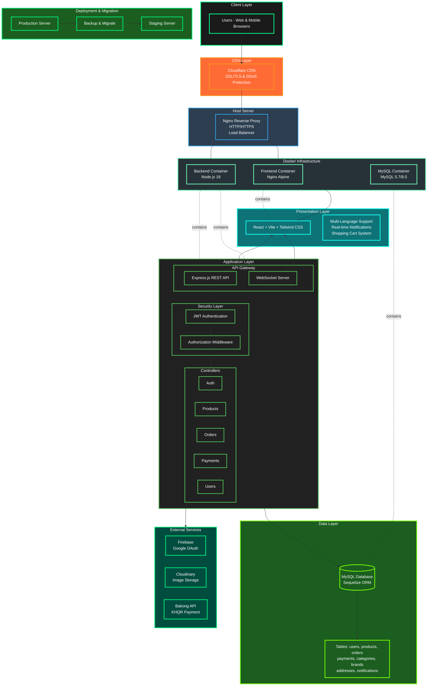

# Asto Gear - Computer Accessories E-commerce Platform

## Project Overview

**Asto Gear** is a full-stack e-commerce web application that allows users to build and purchase computer accessories with ease. The platform features real-time notifications, multi-language support, and integrated payment through Bakong API. All orders come with **free delivery** for users.

---

## System Architecture



---

## Key Features

### Authentication
- User registration and login (manual or Google OAuth)
- JWT-based authentication with cookies and authorization headers
- Secure session management

### E-commerce Functionality
- Browse computer accessories and components
- Search products by name
- Filter products by brand and category
- Add products to shopping cart
- View order receipts

### Seller Dashboard
- Full CRUD operations for products, brands, and categories
- Track user login/signup activity
- Manage product inventory

### Real-time Features
- WebSocket notifications for order updates
- Live order tracking

### Payment Integration
- Bakong KHQR payment gateway
- Secure payment processing

### Multi-language Support
- Language options: Khmer, Chinese, English
- Flag-based language switcher

### Delivery Management
- User input for phone number and address
- Multiple delivery provider options:
  - JNT Express
  - Vireak Buntham
  - Grab

### Contact & Support
- About Us page
- Contact via Telegram, Facebook, and Instagram

---

## Tech Stack

### Backend
- **Node.js** & **Express.js** - Server framework
- **MySQL** - Relational database
- **Sequelize** - ORM for database management
- **Firebase** - Authentication services
- **WebSocket** - Real-time communication
- **Nodemailer** - Email notifications
- **Bakong API** - Payment integration
- **JWT** - Token-based authentication
- **Cloudinary** - Image storage and optimization

### Frontend
- **React** with **Vite** - Fast development environment
- **Tailwind CSS** - Utility-first styling
- **Socket.io** - WebSocket client
- **React Toast** - User notifications

### DevOps
- **Docker** & **Docker Compose** - Containerization
- **Nginx** - Reverse proxy and static file serving

---

## Project Structure

```
project-root/
│
├── backend/                     # Backend Node.js app
│   ├── config/                  # Database & service configurations
│   ├── controllers/             # Business logic (address, brand, category, order, etc.)
│   ├── mail/                    # Email templates and nodemailer setup
│   ├── middleware/              # Authentication & authorization middleware
│   ├── models/                  # Sequelize models (User, Product, Order, etc.)
│   ├── routes/                  # API route definitions
│   ├── utils/                   # Helper functions
│   ├── node_modules/
│   ├── .dockerignore
│   ├── .env.example
│   ├── Dockerfile
│   ├── package-lock.json
│   ├── package.json
│   ├── server.js                # Main server entry point
│   └── wait-for-db.sh           # Database connection wait script
│
├── frontend/                    # Frontend Vite app
│   ├── context/                 # React Context for state management
│   ├── dist/                    # Production build output
│   ├── node_modules/
│   ├── public/                  # Static assets
│   ├── src/                     # React components and pages
│   ├── utils/                   # Frontend helper functions
│   ├── .dockerignore
│   ├── .env.development         # Development environment variables
│   ├── .env.production          # Production environment variables
│   ├── Dockerfile
│   ├── eslint.config.js
│   ├── index.html
│   ├── nginx.dev.conf           # Nginx config for development
│   ├── nginx.prod.conf          # Nginx config for production
│   ├── package-lock.json
│   ├── package.json
│   ├── socket.js                # WebSocket configuration
│   └── vite.config.js
│
├── .env                         # Root environment variables
├── .gitignore
├── docker-compose.yml           # Docker orchestration
└── README.md
```

---

## Installation & Setup

### Prerequisites
- Node.js (v16 or higher)
- MySQL database
- Docker & Docker Compose (optional)

### 1. Clone the Repository
```bash
git clone <repository-url>
cd asto-gear
```

### 2. Database Setup
Create a MySQL database and configure the required tables according to your schema.

### 3. Backend Setup

```bash
cd backend
npm install
```

Create a `.env` file in the backend directory with the following variables:

```env
# Database Configuration
DB_NAME=your_database_name
DB_USER=your_database_user
DB_PASSWORD=your_database_password
DB_HOST=localhost

# Cloudinary Configuration
CLOUD_NAME=your_cloudinary_name
CLOUD_API_KEY=your_cloudinary_api_key
CLOUD_API_SECRET=your_cloudinary_api_secret

# JWT Secret
JWT_SECRET=your_jwt_secret

# Firebase Configuration
FIREBASE_API_KEY=your_firebase_key

# Bakong API
BAKONG_API_KEY=your_bakong_key

# Email Configuration
EMAIL_USER=your_email
EMAIL_PASSWORD=your_email_password
```

**Database Configuration (Sequelize):**
```javascript
import { Sequelize } from 'sequelize';

export const sequelize = new Sequelize(
  process.env.DB_NAME,
  process.env.DB_USER,
  process.env.DB_PASSWORD,
  {
    host: process.env.DB_HOST,
    dialect: 'mysql',
    logging: false,
  }
);
```

**Cloudinary Configuration:**
```javascript
import {v2 as cloudinary} from 'cloudinary'
import {CloudinaryStorage} from 'multer-storage-cloudinary'

cloudinary.config({
    cloud_name: process.env.CLOUD_NAME,
    api_key: process.env.CLOUD_API_KEY,
    api_secret: process.env.CLOUD_API_SECRET
});

const storage = new CloudinaryStorage({
  cloudinary,
  params: {
    folder: 'products',
    allowed_formats: ['jpg', 'jpeg', 'png', 'webp'],
    transformation: [
      { width: 500, height: 500, crop: 'limit', quality: 'auto', fetch_format: 'auto' }
    ],
    public_id: (req, file) => {
      const uniqueSuffix = Date.now();
      const nameWithoutExt = file.originalname.replace(/\.[^/.]+$/, '');
      return `${nameWithoutExt}_${uniqueSuffix}`;
    }
  }
});
```

**Run the backend:**
```bash
nodemon server.js
```

### 4. Frontend Setup

```bash
cd frontend
npm install
```

Create environment files:

**.env.development:**
```env
VITE_API_URL=http://localhost:5000
VITE_SOCKET_URL=http://localhost:5000
```

**.env.production:**
```env
VITE_API_URL=https://your-production-api.com
VITE_SOCKET_URL=https://your-production-api.com
```

**Run the frontend:**
```bash
npm run dev
```

### 5. Docker Setup (Optional)

To run the entire application with Docker:

```bash
docker-compose up --build
```

---

## Usage

1. **Access the application:**
   - Frontend: `http://localhost:5173`
   - Backend API: `http://localhost:5000`

2. **User Flow:**
   - Register/Login to the platform
   - Browse products and add to cart
   - Enter delivery information
   - Complete payment via Bakong KHQR
   - Track order status in real-time

3. **Seller Flow:**
   - Login with seller credentials
   - Manage products, brands, and categories
   - View user activity and orders

---

## Available Scripts

### Backend
```bash
npm start          # Start server with Node
nodemon server.js  # Start server with auto-reload
```

### Frontend
```bash
npm run dev        # Start development server
npm run build      # Build for production
npm run preview    # Preview production build
```

---

## Security Features

- JWT authentication with HTTP-only cookies
- Authorization headers for API requests
- Google OAuth integration
- Secure password hashing
- Environment-based configuration

---

## API Endpoints

The backend provides RESTful API endpoints for:
- Authentication (`/api/auth`)
- Products (`/api/products`)
- Categories (`/api/categories`)
- Brands (`/api/brands`)
- Orders (`/api/orders`)
- Payments (`/api/payments`)
- User management (`/api/users`)

---

## Contact

For any inquiries or support, reach out via:
- **Telegram:** [@Reajasey]
- **Facebook:** [https://www.facebook.com/pisey.khenchandara]


## Acknowledgments

- Bakong API for payment integration
- Cloudinary for image management
- Firebase for authentication services
- All open-source libraries used in this project# test

