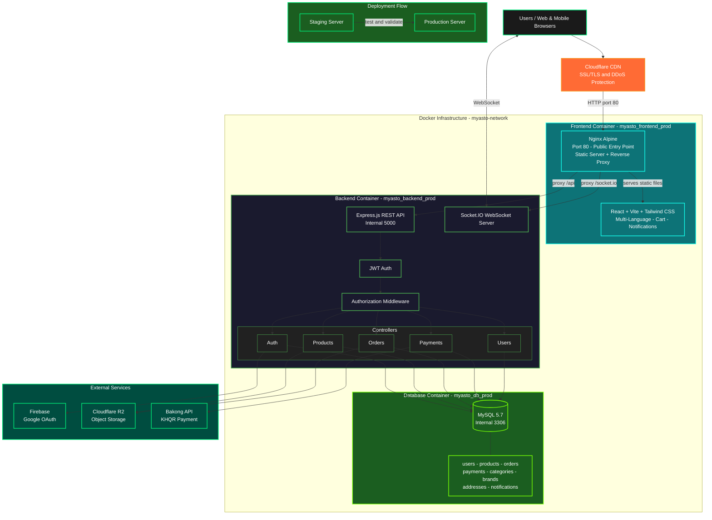

# Asto Gear - Computer Accessories E-commerce Platform

🌐 **Live Demo:** [astogear.com](https://astogear.com)

---

## Full Demo Video

[Watch the complete walkthrough on YouTube](https://www.youtube.com/watch?v=LKBMF5jg0k8)

---

## Demo

### Authentication


### Homepage & Product Browsing


### Product Details


### Shopping Cart & Checkout


### Payment Integration


### Real-time Notifications


### Seller Dashboard


---

## System Architecture



The diagram above illustrates the complete system architecture of Asto Gear, showing the flow from users through CDN and reverse proxy layers, to the containerized application services, database, and external API integrations.

---

## Project Overview

**Asto Gear** is a full-stack e-commerce web application that allows users to build and purchase computer accessories with ease. The platform features real-time notifications, multi-language support, and integrated payment through Bakong API. All orders come with **free delivery** for users.

---

## Key Features

### Authentication
- User registration and login (manual or Google OAuth)
- JWT-based authentication with cookies and authorization headers
- Email verification, forgot password, and password reset flow
- Secure session management

### E-commerce Functionality
- Browse computer accessories and components
- Search products by name
- Filter products by brand and category
- Add products to shopping cart
- View order receipts

### Seller Dashboard
- Full CRUD operations for products, brands, categories, and product banners
- Track user login/signup activity
- Manage product inventory and orders

### Real-time Features
- Socket.IO notifications for order status updates
- Live order tracking

### Payment Integration
- Bakong KHQR payment gateway
- Secure payment processing

### Multi-language Support
- Language options: Khmer, Chinese, English
- Flag-based language switcher

### Delivery Management
- User input for phone number and address
- Multiple delivery provider options:
  - JNT Express
  - Vireak Buntham
  - Grab

### Contact & Support
- About Us page
- Contact via Telegram, Facebook, and Instagram

---

## Tech Stack

### Backend
- **Node.js** & **Express.js** (ESM) - Server framework
- **MySQL 5.7** - Relational database
- **Sequelize** - ORM for database management
- **Firebase** - Google OAuth authentication
- **Socket.IO** - Real-time WebSocket communication
- **Nodemailer** - Email notifications (verification, reset, welcome)
- **Bakong API** - KHQR payment integration
- **JWT** - Token-based authentication (HTTP-only cookies)
- **Cloudflare R2** - Image storage (S3-compatible)

### Frontend
- **React 19** with **Vite 7** - Fast development environment
- **Tailwind CSS 4** - Utility-first styling
- **React Router v7** - Client-side routing
- **Socket.io-client** - WebSocket client
- **Axios** - HTTP client with interceptors

### DevOps
- **Docker** & **Docker Compose** - Containerization (dev + production configs)
- **Nginx** - Reverse proxy and static file serving
- **GitHub Actions** - CI/CD with staging → production pipeline, DB backup, and auto-rollback

---

## Project Structure

```
myasto/
├── .github/
│   └── workflows/
│       ├── deploy-production.yml      # SSH deploy to VPS + DB backup + rollback
│       ├── deploy-staging.yml         # Staging CI/CD workflow
│       └── test.yml                   # Test runner workflow
│
├── backend/
│   ├── config/
│   │   ├── cloudinary.js              # Cloudinary SDK setup (legacy)
│   │   ├── r2.js                      # Cloudflare R2 (S3-compatible) config
│   │   └── sequelize.js               # Sequelize / MySQL connection config
│   ├── controllers/
│   │   ├── auth.controller.js         # Register, login, logout, verify, reset password
│   │   ├── brand.controller.js        # CRUD for product brands
│   │   ├── category.controller.js     # CRUD for product categories
│   │   ├── notificatoin.controller.js # Real-time notification logic
│   │   ├── order.controller.js        # Order creation and status updates
│   │   ├── payment.controller.js      # Bakong KHQR payment processing
│   │   ├── product.controller.js      # CRUD for products, images, features
│   │   ├── productBanner.controller.js# Homepage banner management
│   │   ├── recipt.controller.js       # Receipt / invoice generation
│   │   └── user.controller.js         # User profile and address management
│   ├── mail/
│   │   ├── generateCode.js            # OTP / verification code generator
│   │   ├── mailerConfig.js            # Nodemailer transport config
│   │   └── mailService/
│   │       ├── EmailService.js
│   │       ├── sendPasswordResetEmail.js
│   │       ├── sendResetSuccessEmail.js
│   │       ├── sendVerificationEmail.js
│   │       └── sendWelcomEmail.js
│   ├── middleware/
│   │   ├── autheticate.js             # JWT verification middleware
│   │   ├── authorizeRoles.js          # Role-based access control (Customer / Seller / Admin)
│   │   ├── loadUserdata.js            # Attach user data to request
│   │   ├── uploadMedia.js             # Multer + R2 file upload
│   │   └── validator.js               # Request input validation
│   ├── models/
│   │   ├── index.js                   # Model associations
│   │   ├── address.js
│   │   ├── brand.js
│   │   ├── category.js
│   │   ├── notification.js
│   │   ├── order.js
│   │   ├── orderItem.js
│   │   ├── payment.js
│   │   ├── product.js
│   │   ├── productBanner.js
│   │   ├── productFeature.js
│   │   ├── productImage.js
│   │   ├── ProductVideo.js
│   │   ├── review.js
│   │   └── user.js
│   ├── routes/
│   │   ├── auth.routes.js
│   │   ├── brand.routes.js
│   │   ├── category.routes.js
│   │   ├── checkout.routes.js
│   │   ├── notification.routes.js
│   │   ├── order.routes.js
│   │   ├── payment.routes.js
│   │   ├── product.routes.js
│   │   ├── recipt.routes.js
│   │   └── user.routes.js
│   ├── scripts/
│   │   └── migrate_cloudinary_to_r2.js# One-time Cloudinary → R2 migration script
│   ├── utils/
│   │   ├── generateOrderID.js
│   │   └── generateTokenAndSetCookie.js
│   ├── .env.example                   # Template for environment variables
│   ├── Dockerfile
│   ├── server.js                      # App entry point (Express + Socket.IO)
│   └── wait-for-db.sh                 # Wait for MySQL health before starting
│
├── frontend/
│   ├── context/                       # Global React contexts
│   │   ├── UserContext.jsx            # Auth / user state
│   │   └── notificationContext/
│   │       └── NotificationContext.jsx
│   ├── utils/                         # Shared utilities & layout components
│   │   ├── AboutUs.jsx
│   │   ├── Footer.jsx
│   │   ├── ScrollToTheTop.jsx
│   │   ├── analytics.jsx              # Google Analytics 4 wrapper
│   │   └── googleTranslateService.js
│   ├── public/
│   │   ├── favicon.png
│   │   └── promotionasto.png
│   ├── src/
│   │   ├── api/                       # Axios API call modules
│   │   │   ├── http.js                # Axios instance (base URL, interceptors)
│   │   │   ├── Auth.api.js
│   │   │   ├── BrandProduct.api.js
│   │   │   ├── CategoryProduct.api.js
│   │   │   ├── Checkout.api.js
│   │   │   ├── notification.api.js
│   │   │   ├── order.api.js
│   │   │   ├── payment.api.js
│   │   │   ├── Product.api.js
│   │   │   ├── ProductBanner.api.js
│   │   │   ├── Recipt.api.js
│   │   │   └── User.api.js
│   │   ├── assets/
│   │   │   ├── ceo/                   # Team / founder photos
│   │   │   ├── flag/                  # Language selector flags (KH, CN, EN)
│   │   │   ├── logoes/                # Brand and social logos
│   │   │   └── qrcode/                # Social media QR codes
│   │   ├── auth/                      # Authentication module
│   │   │   ├── RootAuthLayout.jsx
│   │   │   ├── components/
│   │   │   │   └── signup/
│   │   │   │       └── GoogleAuth.jsx # Firebase Google OAuth button
│   │   │   ├── firebase/
│   │   │   │   └── config.js
│   │   │   └── pages/
│   │   │       ├── Login.jsx
│   │   │       ├── Signup.jsx
│   │   │       ├── VerifyEmail.jsx
│   │   │       ├── EmailEntry.jsx
│   │   │       ├── ForgotPassword.jsx
│   │   │       └── ResetPassword.jsx
│   │   ├── customer/                  # Customer-facing storefront
│   │   │   ├── RootCustomerLayout.jsx
│   │   │   ├── context/
│   │   │   │   └── CartContext.jsx    # Shopping cart state
│   │   │   ├── components/
│   │   │   │   ├── address/           # Phone, location, delivery selector
│   │   │   │   └── recipt/            # Receipt header and body
│   │   │   └── pages/
│   │   │       ├── Homepage.jsx
│   │   │       ├── NotFound.jsx
│   │   │       └── checkout/
│   │   │           ├── KHQR/          # QR code display, timer, expiry
│   │   │           └── Order/         # Cart, summary, empty state
│   │   ├── seller/                    # Seller / Admin dashboard
│   │   │   ├── RootSellerLayout.jsx
│   │   │   └── components/
│   │   │       ├── header/            # Search, notifications, language switcher
│   │   │       ├── leftNavbar/        # Sidebar navigation
│   │   │       ├── mainContent/
│   │   │       ├── category_brand_product/
│   │   │       │   ├── brandManagement/
│   │   │       │   ├── categoryManagement/
│   │   │       │   └── productManagement/
│   │   │       │       ├── productBanner/
│   │   │       │       └── products/
│   │   │       ├── orderManagement/   # Orders table + order detail view
│   │   │       └── user/              # User list and activity monitoring
│   │   ├── App.jsx                    # Root router (React Router v7)
│   │   └── main.jsx                   # React DOM entry point
│   ├── socket.js                      # Socket.IO client singleton
│   ├── nginx.development.conf
│   ├── nginx.production.conf
│   ├── Dockerfile                     # Multi-stage: Vite build → Nginx serve
│   └── vite.config.js
│
├── docker-compose.dev.yml             # Dev: MySQL, backend :5000, frontend :80
├── docker-compose.production.yml      # Prod: all containers on internal network
└── README.md
```

---

## Getting Started

### Prerequisites

- Node.js v18+
- MySQL 5.7+
- Docker & Docker Compose (for containerized setup)

### Option 1 — Docker (Recommended)

Runs the entire stack (MySQL + backend + frontend) in one command.

**Development:**

```bash
docker-compose -f docker-compose.dev.yml up --build
```

**Production:**

```bash
docker-compose -f docker-compose.production.yml up --build
```

Stop containers:

```bash
docker-compose -f docker-compose.dev.yml down
```

The app will be available at `http://localhost`.

---

### Option 2 — Manual Setup

> Start order: database first, then backend, then frontend.

**1. Clone the repository**

```bash
git clone https://github.com/your-username/asto-gear.git
cd asto-gear
```

**2. Backend**

```bash
cd backend
npm install
cp .env.example .env    # fill in your values (see Environment Variables below)
node server.js          # or: nodemon server.js for auto-reload
```

Backend API will be available at `http://localhost:5000`.

**3. Frontend**

```bash
cd frontend
npm install
npm run dev
```

Frontend will be available at `http://localhost:5173`.

---

## Environment Variables

### `backend/.env`

```env
# Database
DB_NAME=your_database_name
DB_USER=your_database_user
DB_PASSWORD=your_database_password
DB_HOST=localhost

# JWT
JWT_SECRET=your_jwt_secret

# Cloudflare R2 (image storage)
R2_ACCESS_KEY_ID=your_r2_access_key
R2_SECRET_ACCESS_KEY=your_r2_secret_key
R2_BUCKET_NAME=your_bucket_name
R2_ENDPOINT=your_r2_endpoint
R2_PUBLIC_URL=your_r2_public_url

# Firebase (Google OAuth)
FIREBASE_API_KEY=your_firebase_api_key

# Bakong (KHQR payment)
BAKONG_API_KEY=your_bakong_key

# Email (Nodemailer)
EMAIL_USER=your_email
EMAIL_PASSWORD=your_email_app_password
```

### `frontend/.env.development`

```env
VITE_API_BASE_URL=http://localhost:5000
```

### `frontend/.env.production`

```env
VITE_API_BASE_URL=https://your-production-domain.com
```

---

## Contact

For any inquiries or support, reach out via:
- **Telegram:** [@Reajasey](https://t.me/Reajasey)
- **Facebook:** [Pisey Khenchandara](https://www.facebook.com/pisey.khenchandara)

---

## Acknowledgments

- [Bakong API](https://bakong.nbc.gov.kh) — KHQR payment integration
- [Cloudflare R2](https://developers.cloudflare.com/r2/) — Image storage
- [Firebase](https://firebase.google.com) — Google OAuth

---

## License

This project is for showcase purposes. All rights reserved.
